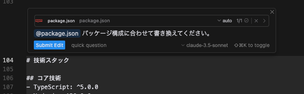
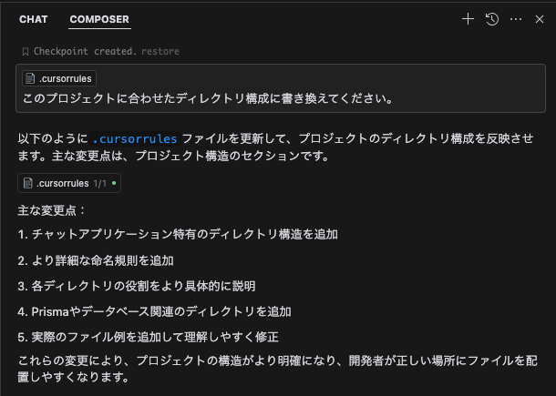
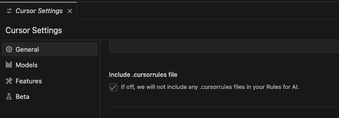

# .cursorrules 「v5」

このリポジトリは、Cursor用のカスタムインストラクション（`.cursorrules`）を管理するためのものです。
過去のバージョンはX（Twitter）で公開し、ご利用いただいた方々からご好評をいただきましたが、SNSでは時間の経過とともに発見が難しくなるため、今後はこのGitHubリポジトリで公開していく予定です。

## 前提

- この`.cursorrules`は、Cursor Composer agent利用に最適化したものです
- Cursor Composer agentが自走（人の介入を受けずに自律処理）ができる前提として、Yoloモードの許可コマンドを適切に設定する必要があります。

## 概要

- Cursor Composerのエージェント機能がリリースされてから、様々なパターンの処理を通して感じたのが「分析力の不足」でした。そのため、モデル（Claude 3.5 Sonnet）が本来持っている分析能力を引き出せるように工夫し始めたのが、私の`.cursorrules`作成の始まりです。

- 次に、Composerが人の介入を受けずに自律処理できる範囲を広げていくことに焦点を当て、かなりの効果を得られました。

- 今回は「手戻り防止」をテーマに、LLMによるコーディングでよく発生する以下の問題への対処を加えたバージョンです：
  1. モデルやAPIのバージョンの先祖返り
  1. モジュールやリソースの重複生成
  1. 意図せぬ、AIによるデザインの変更
  1. エラー処理の無限ループ

- より具体的な記述（技術スタック、APIバージョン管理、プロジェクト構成）を加える構成となったため、ファイルコピーだけですぐに使えるスタイル（v1）から、カスタマイズしてご利用いただくスタイル（v5）に変更になっています。プロジェクトに合わせてカスタマイズしてご利用ください。

- `.cursorrules`の作成プロセスとしては、初期にAnthropic Prompt Generatorで作成したものを、Claude 3.5 SonnetやChatGPT（o1 pro）などを使って調整し、Cursorで実施検証を繰り返しました。カスタマイズの際も、AIによる評価を行うことを推奨します。

- 限られた環境と時間での検証のため、用途や環境によって効果に差が生じる可能性があります。この`.cursorrules`はあくまでもひな形として捉え、ご自身の環境やプロジェクトに合わせてカスタマイズしてご利用ください。

## 使用方法

1. `.cursorrules`ファイルをプロジェクトのルートディレクトリに保存します。
    - 細かい制御を行いたい場合、v5をご利用ください：[v5/.cursorrules](v5/.cursorrules)
    - 分析力、自走力がアップすれば十分な場合、v1をご利用ください：[v1/.cursorrules](v1/.cursorrules)
1. v5の技術スタック、APIバージョン管理、プロジェクト構成は記載例です。ご自身の環境に合わせてカスタマイズしてください。
    - Cursorでの編集を推奨。
    - 例：node系のプロジェクトであれば、コマンド+Kでpackage.jsonを参照して書かせると楽です。
    
    - 例：プロジェクト構成はComposer normalモードで書き換えると楽です。
    
    - 参照させるのによいファイル、ディレクトリがない場合、ご利用の言語、フレームワーク、ライブラリなどに応じた「ベストプラクティスに沿って書き換えて」といったプロンプトでの更新でも可です。
    - プロジェクトの進行に伴い、技術スタック、APIバージョン管理、プロジェクト構成に変更がある場合は、適宜更新しながら利用することで効果的な運用が可能です。
1. カスタムインストラクションは、プロンプトにおけるタスク設計、コンテキスト（参照資料など）との組み合わせで最大限の効果を発揮します。ぜひ研究を深めてください。

## 注意事項

- 「Include .cursorrules file」設定がオフになっていると、`.cursorrules`が読み込まれないのでご注意ください。

- Rules for AIに矛盾する内容の記載があると効果が減少します。Rules for AIの記載内容を十分にご確認ください。

## ライセンス

MITライセンスの下で公開されています。詳細については[LICENSE](LICENSE)ファイルを参照してください。

## サポート

- このリポジトリのサポートはありませんが、フィードバックは歓迎いたします。また、Cursor関連情報をX（Twitter）で発信しているので、ご興味あればご覧ください。
[X（Twitter）](https://x.com/kinopee_ai)
