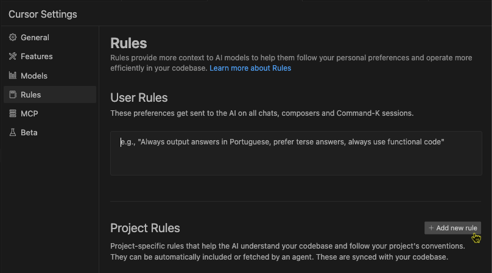

# cursorrules 「v5」

このリポジトリは、Cursor用のカスタムインストラクションを管理するためのものです。

## 前提

- この`v5`は、Cursor Agent利用に最適化したものです
- Cursor Agent が自走（人の介入を受けずに自律処理）ができる前提として、Yoloモードの許可コマンドを適切に設定する必要があります。
- 最新の更新内容については[更新履歴](CHANGELOG.md)を参照してください。

## 概要

- Cursor のエージェント機能がリリースされてから、様々なパターンの処理を通して感じたのが「分析力の不足」でした。そのため、モデル（Claude 3.5 Sonnet）が本来持っている分析能力を引き出せるように工夫し始めたのが、私のカスタムインストラクション作成の始まりです。

- 次に、Cursor Agentが人の介入を受けずに自律処理できる範囲を広げていくことに焦点を当て、かなりの効果を得られました。

- さらに、「手戻り防止」をテーマに、LLMによるコーディングでよく発生する以下の問題への対処を加えました：
  1. モデルやAPIのバージョンの先祖返り
  1. モジュールやリソースの重複生成
  1. 意図せぬ、AIによるデザインの変更
  1. エラー処理の無限ループ

- Cursor 0.45 でカスタムインストラクションの管理方法が `.cursorrules` から Project Rules に変更になりました。本バージョンでは Project Rules に対応、インストラクションの内容も Claude 3.7 Sonnet に最適化したものに更新しました。

- 技術スタック、ディレクトリ構成は、カスタムインストールから別ファイルに分離して、@ 記号で参照する別ファイルとして定義されています。プロジェクトのルートにファイルを配置して、@ 記号でファイルの参照を定義し直してください。

- この分離により、技術スタック、ディレクトリ構成などの変更に対して、より柔軟に対応できるようになりました（それぞれのファイルの内容は実際のプロジェクトに合わせて更新してください/更新もCursor Agentで可能です）。

- `v5`の作成プロセスとしては、初期にAnthropic Prompt Generatorで作成したものを、Claude 3.5 SonnetやChatGPT（o1 pro）などを使って調整し、Cursorで実施検証を繰り返しました。カスタマイズの際も、AIによる評価を行うことを推奨します。

- 限られた環境と時間での検証のため、用途や環境によって効果に差が生じる可能性があります。この`v5`はあくまでもひな形として捉え、ご自身の環境やプロジェクトに合わせてカスタマイズしてご利用ください。

- 詳細な更新内容については[CHANGELOG.md](CHANGELOG.md)を参照してください。

## 使用方法

1. Cursorの設定画面、「Rules」タブで「Project Rules」エリア内の「Add new rule」ボタンをクリックします。
2. 「global」以外の適用な名前のルール名を指定して、Enterします。
3. `.cursor/rules`フォルダが作成されるので、本リポジトリの「global.mdc」をコピーして、そこに保存します。
4. 2.で作成したファイルを削除（その操作はフォルダをCursorに作成させるために実施します）。
5. `technologystack.md`、`directorystructure.md`をプロジェクトのルートディレクトリに保存します（不要な場合はこのステップをスキップ、global.mdcの該当部も削除してください）。

- Project Rules では、ファイルやフォルダのパターンマッチングで適用するルールを切り替える機能があります。v5をグローバルに適用した上で、言語やフレームワークごとのコード規約などに個別対応したルールを適用させることも可能です。
- @ 記号によるファイル参照はとても便利です。他にも参照させたい情報がある場合は活用してみてください。
- カスタムインストラクションは、プロンプトにおけるタスク設計、コンテキスト（参照資料など）との組み合わせで最大限の効果を発揮します。ぜひ研究を深めてください。

## 注意事項

- Rules for AIに、矛盾する指示、大量の記載があると効果が減少します。Rules for AIの記載内容を十分にご確認ください。

## ライセンス

MITライセンスの下で公開されています。詳細については[LICENSE](LICENSE)ファイルを参照してください。

## サポート

- このリポジトリのサポートはありませんが、フィードバックは歓迎いたします。また、Cursor関連情報をX（Twitter）で発信しているので、ご興味あればご覧ください。
[X（Twitter）](https://x.com/kinopee_ai)
